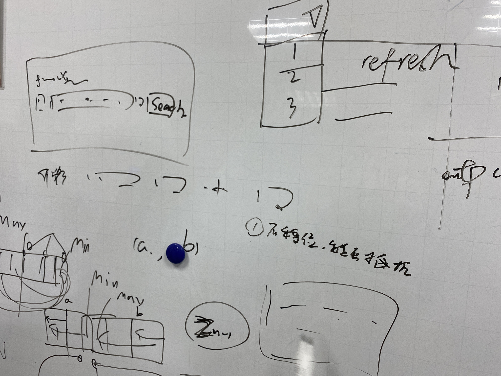
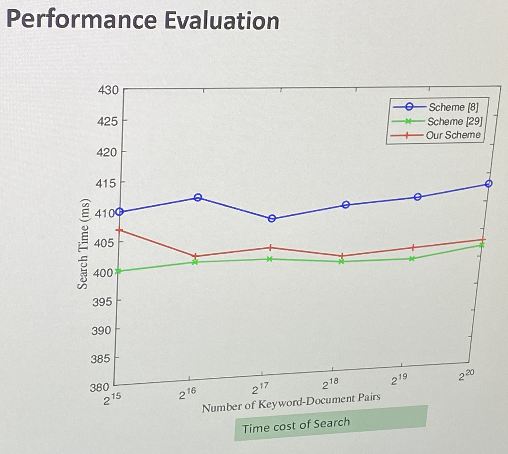

# 周会记录 sse- week13

## Paper

数据结构方案: 抵抗 CPA 选择明文攻击
保序 加密 determined ordered data
参考的几篇论文:

- 攻击 refer [1]
- Frequency hiding[37]
- Popa et al.[54]

### Direction

能否进行攻击 对于移位

## 如何看论文 - scheme

### abstract

陈述问题；如何抵御 CPA
e.g. 抵御攻击， 攻击是什么，为什么能抵御
相关论文

### scheme 介绍

- 相关的 tag
- \_motivation\_
- dynamic data
- \_range query\_：除了顺序其他不泄漏

## Clusion

设计界面展示模板
统一输入和输出

- 总体架构:
  
- 展示页面:
  

1. 后端文档整合
2. setup；search
3. 后续支持**国密**

## wangScheme

1. (keyword, file-id)根据图片进行分割

2. 尝试小数据增量测试 setup - search
